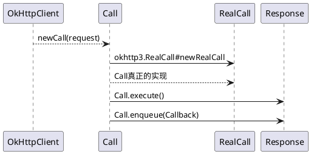

# OkHttp源码分析(一)  请求的大致流程
> 从使用用法开始入手


## okhttp 拉取数据两种方式：
*    同步执行（**`execute()`**）

    ```java
    //同步获取
    val execute = OkHttpClient.Builder()
                    .build()
                    .newCall(Request.Builder()
                    .url("http://www.baidu.com").build())
                    .execute();
    ```
*    异步执行（**`enqueue(Callback)`**）

    ```kotlin
     
     //异步获取
     OkHttpClient.Builder().build()
         .newCall(Request.Builder().url("http://www.baidu.com").build())
         .enqueue(object : Callback {
            override fun onFailure(call: Call, e: IOException) {
                    Log.e("zoudong","onFailure isExecuted=${call.toString()} ",e)
           }
            override fun onResponse(call: Call, response: Response) {
                    Log.e("zoudong","onResponse isExecuted=${call.isExecuted} threed=${Thread.currentThread().name} ,response=${response.receivedResponseAtMillis() - response.sentRequestAtMillis()}")
            }
    }
    ```


## 开动
一个请求发出我们需要准备两个对象  `OkHttpClient` , `Request`

1. ### `OkHttpClient`装配一个`Request`


   通过`OkHttpClient.newCall(Request)`来装配一个`Request`
       
    ```java
    // okhttp3.OkHttpClient#newCall
     @Override 
     public Call newCall(Request request) {
            return RealCall.newRealCall(this, request, false /* for web socket */);
      }
      
      
     //okhttp3.RealCall#newRealCall
      static RealCall newRealCall(OkHttpClient client, Request originalRequest, boolean forWebSocket) {
            // Safely publish the Call instance to the EventListener.
            RealCall call = new RealCall(client, originalRequest, forWebSocket);
            call.eventListener = client.eventListenerFactory().create(call);
        return call;
      }
      
      
      //okhttp3.RealCall#RealCall
      private RealCall(OkHttpClient client, Request originalRequest, boolean forWebSocket) {
            this.client = client;
            this.originalRequest = originalRequest;
            this.forWebSocket = forWebSocket;
            this.retryAndFollowUpInterceptor = new RetryAndFollowUpInterceptor(client, forWebSocket);
            this.timeout = new AsyncTimeout() {
              @Override protected void timedOut() {
                cancel();
              }
            };
            this.timeout.timeout(client.callTimeoutMillis(), MILLISECONDS);
      }
    ```

2. ### `OkHttpClient.Call 执行`
  
  ```java
  //okhttp3.Call
  public interface Call extends Cloneable {
      
      Request request();
     
      Response execute() throws IOException;

      void enqueue(Callback responseCallback);
      
      void cancel();
    
      boolean isExecuted();
    
      boolean isCanceled();
    
      Timeout timeout();
    
      Call clone();
    
      interface Factory {
        Call newCall(Request request);
      }
    }  
  ```
  
   Call真正的实现 okhttp3.RealCall， okhttpClient通过 newCall(request) 通过 okhttp3.RealCall#newRealCall包装request 后生成RealCall 通过 RealCall执行发出请求的操作


### 我们先看 `okhttp3.RealCall#execute()`
```java
@Override 
public Response execute() throws IOException {
    ...
    try {
      client.dispatcher().executed(this);
      Response result = getResponseWithInterceptorChain();
      if (result == null) throw new IOException("Canceled");
      return result;
    } catch (IOException e) {
      e = timeoutExit(e);
      eventListener.callFailed(this, e);
      throw e;
    } finally {
      client.dispatcher().finished(this);
    }
  }
```
取出关键代码
```java
client.dispatcher().executed(this); //加入同步队列
Response result = getResponseWithInterceptorChain();//生成 链式拦截器
client.dispatcher().finished(this);//
```
okhttp3.OkHttpClient#dispatcher 我们可以理解为 Call事件的分发器！ （暂时这里理解下次分析）
```java
synchronized void executed(RealCall call) {
    runningSyncCalls.add(call);
  }

void finished(RealCall call) {
    finished(runningSyncCalls, call);
  }
  
private <T> void finished(Deque<T> calls, T call) {
    Runnable idleCallback;
    synchronized (this) {
      if (!calls.remove(call)) throw new AssertionError("Call wasn't in-flight!");
      idleCallback = this.idleCallback;
    }
    // promoteAndExecute 执行下一个异步Call
    boolean isRunning = promoteAndExecute();
    //isRunning 表示两个队列是否还有Call  isRunning=false 队列中无Call isRunning=true 对列表还有Call
    
    // Runnable idleCallback okhttp3.Dispatcher#setIdleCallback
    if (!isRunning && idleCallback != null) {
      idleCallback.run();
    }
  }
```
那问题来了Response怎么样返回的呢， 怎么样开始请求数据的呢？？？

仔细看的同学，应该很明显上面有三个关键方法， 我们只讲了两个方法，还有一个关键方法 `getResponseWithInterceptorChain()`  看这个方法的名字就知道 返回Response的。
```java
Response getResponseWithInterceptorChain() throws IOException {
    // Build a full stack of interceptors.
    List<Interceptor> interceptors = new ArrayList<>();
    interceptors.addAll(client.interceptors());
    interceptors.add(retryAndFollowUpInterceptor);
    interceptors.add(new BridgeInterceptor(client.cookieJar()));
    interceptors.add(new CacheInterceptor(client.internalCache()));
    interceptors.add(new ConnectInterceptor(client));
    if (!forWebSocket) {
      interceptors.addAll(client.networkInterceptors());
    }
    interceptors.add(new CallServerInterceptor(forWebSocket));

    Interceptor.Chain chain = new RealInterceptorChain(interceptors, null, null, null
  , 0,originalRequest, this, eventListener,     client.connectTimeoutMillis(),
     client.readTimeoutMillis(),client.writeTimeoutMillis());

    return chain.proceed(originalRequest);
  }
```
通过上面代码我们知道 `getResponseWithInterceptorChain`才是正真返回 `Response`的方法！
 **Interceptor** 这个是重点 下期再来搞它

### 我们再看 `okhttp3.RealCall#enqueue()`
```java
@Override 
public void enqueue(Callback responseCallback) {
    ...
    client.dispatcher().enqueue(new AsyncCall(responseCallback));
}
```
异步执行 `enqueue` 使用了 `AsyncCall(extends NamedRunnable)` 

```java
//okhttp3.Dispatcher#enqueue
void enqueue(AsyncCall call) {
    synchronized (this) {
      readyAsyncCalls.add(call);  //异步队列
    }
    promoteAndExecute();
  }
  
  //遍历查找可执行的异步Call ,并且执行异步调用
private boolean promoteAndExecute() {
    assert (!Thread.holdsLock(this));
    List<AsyncCall> executableCalls = new ArrayList<>();
    boolean isRunning;
    synchronized (this) {
      for (Iterator<AsyncCall> i = readyAsyncCalls.iterator(); i.hasNext(); ) {
        AsyncCall asyncCall = i.next();

        if (runningAsyncCalls.size() >= maxRequests) break; // Max capacity.
        if (runningCallsForHost(asyncCall) >= maxRequestsPerHost) continue; // Host max capacity.

        i.remove();
        executableCalls.add(asyncCall);
        runningAsyncCalls.add(asyncCall);
      }
      isRunning = runningCallsCount() > 0;
    }

    for (int i = 0, size = executableCalls.size(); i < size; i++) {
        //执行AsyncCall开始执行异步操作
      AsyncCall asyncCall = executableCalls.get(i);
      asyncCall.executeOn(executorService());
    }

    return isRunning;
  }
```
通过readyAsyncCalls 遍历和过滤生成可以执行队列 `runningAsyncCalls`队列和 `executableCalls`队列。
 
readyAsyncCalls 生成 executableCalls 有两个限制条件，请求Call 必须小于maxRequests（64），host小于maxRequestsPerHost（5）

executableCalls 遍历执行 ` asyncCall.executeOn(executorService());`而 `executorService()`返回的是一个线程池。


继续跟进  我们知道  AsyncCall是一个`implements Runnable`
```java
//  okhttp3.Dispatcher#promoteAndExecute 调用
void executeOn(ExecutorService executorService) {
      assert (!Thread.holdsLock(client.dispatcher()));
      boolean success = false;
      try {
       // 调用Runnable#run方法
        executorService.execute(this);
        success = true;
      } catch (RejectedExecutionException e) {
        InterruptedIOException ioException = new InterruptedIOException("executor rejected");
        ioException.initCause(e);
        eventListener.callFailed(RealCall.this, ioException);
        responseCallback.onFailure(RealCall.this, ioException);
      } finally {
        if (!success) {
          client.dispatcher().finished(this); // This call is no longer running!
        }
      }
}

// run方法包装的 execute()
@Override 
protected void execute() {
      boolean signalledCallback = false;
      timeout.enter();
      try {
        Response response = getResponseWithInterceptorChain();
        if (retryAndFollowUpInterceptor.isCanceled()) {
          signalledCallback = true;
          responseCallback.onFailure(RealCall.this, new IOException("Canceled"));
        } else {
          signalledCallback = true;
          responseCallback.onResponse(RealCall.this, response);
        }
      } catch (IOException e) {
        e = timeoutExit(e);
        if (signalledCallback) {
          // Do not signal the callback twice!
          Platform.get().log(INFO, "Callback failure for " + toLoggableString(), e);
        } else {
          eventListener.callFailed(RealCall.this, e);
          responseCallback.onFailure(RealCall.this, e);
        }
      } finally {
        client.dispatcher().finished(this);
      }
}
```
异常执行 也有几个关键方法
```java
client.dispatcher().enqueue(new AsyncCall(responseCallback));
Response response = getResponseWithInterceptorChain();
client.dispatcher().finished(this);
```
OkHttpClient 同步获取和异步获取`Response` 大致的不同到这里大致有所了解了吧！
**想必大家对 Dispatcher 和  Interceptor 有很大的疑问？？？**
> 这两块内容过多， 下次分析


## 总结：
 同步和异步调用大致流程一致，同步请求 通过`getResponseWithInterceptorChain()`直接返回 `Response` 异步方法 通过线程池方式调用`getResponseWithInterceptorChain()`直接返回 `Response`
 
 注意：`enqueue(Callback)` 的 `Callback`回调是在线程(Okhttp)中执行的 ，并不是主线程(main)

## 下期内容
 OkHttp源码 之 Dispatcher
 OkHttp源码 之 Interceptor
